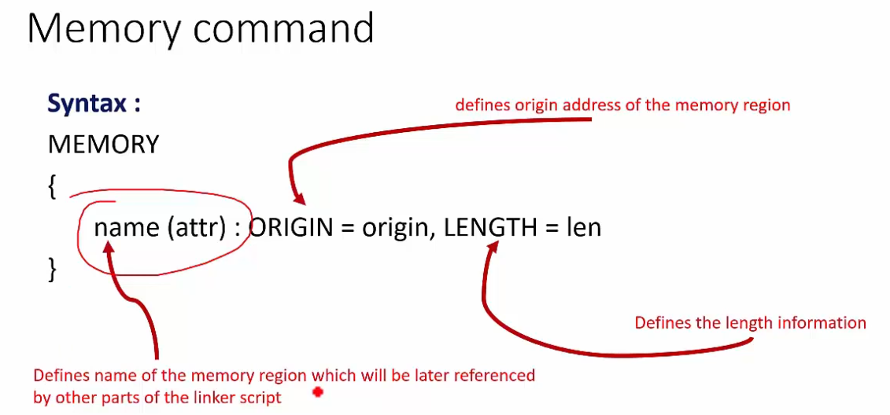
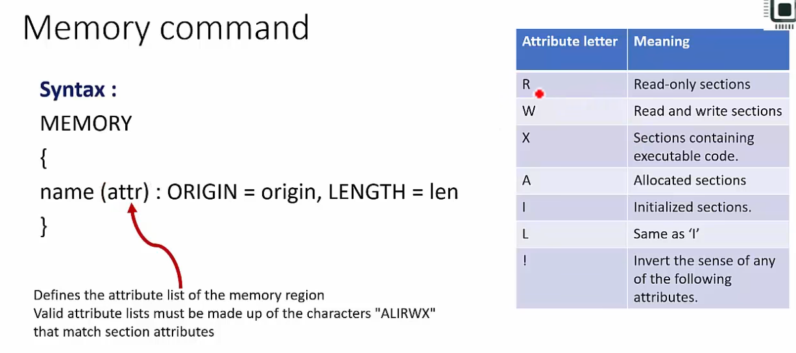

# linker script
* linker script is a text file which explains how different sections of object files should be merged to create an executable file
* linker script also describe the memory layout of the microcontroller
    * it define code and data memory addresses and size information 
    * it define the starting address and size  of flash and RAM
* linker scripts are written in GNU linker command language
* GNU linker script has a file extension of .ld

## How to write a linker script

### linker script commands
```bash
* ENTRY
* MEMORY
* SECTIONS
* KEEP
* ALIGN
* AT
```

* MEMORY:
    * This command allows you to describe the different memories present in the target and their start address and size information
    * The linker uses information mentioned in this command to assign addresses to merged sections
    * The information is given under this command also helps the linker to calculate total code and data memory consumed so far and throw an error message if data, code, heap or stack areas cannot fit into available size
    * By using memory command, you can fine-tune various memories available in your target and allow different sections to occupy different memory areas
    * Typically one linker script has one memory command





### note
* in linker we cant declare variables for storing information (that is only possible in c),instead we need to do symbols for storing momentory data

# linker and locator
linker and locator combination assigns unique absolute addresses to different sections of output file by referring to address information mentioned in the linker script

Example linker script written for B-L072Z-LRWAN1 can be found [here]("../utils/linker/STM32L072CZYX_FLASH.ld")