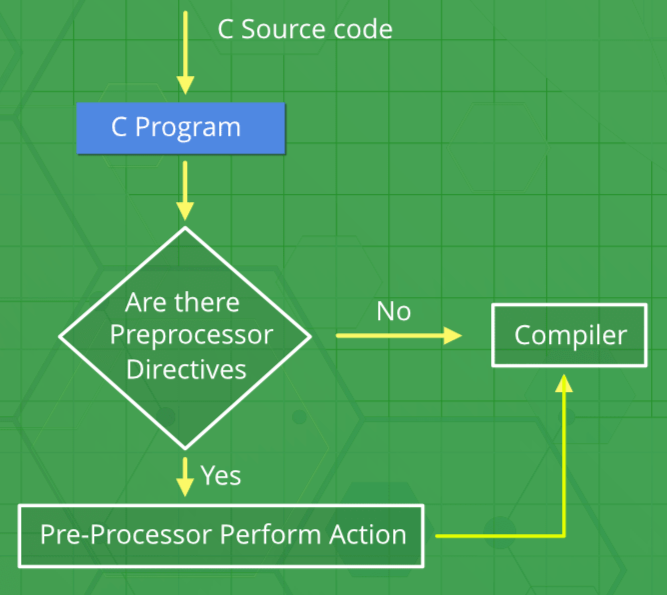

# C Preprocessors
 

* Preprocessors are programs that process the source file before compilation.
* When a C source file is provided to the build toolchain, it is first passed to the preprocessor.
* The preprocessor processes the file, generating an expanded source file with the extension `.i`
* This expanded file is then forwarded to the compiler for further processing.

## Preprocessor Directives in C

* Preprocessor directives are the special instructions that tell the build toolchain to preprocess the source code before compiling.
* All of these preprocessor directives begin with a `#`symbol.
* We can place these preprocessor directives anywhere in our program.

```bash
# Note
The "#" symbol only provides a path to the preprocessor and the  command after "#" is processed by the preprocessor.
```

### **Preprocessor directives in C**

The following table lists all the preprocessor directives in C

**Preprocessor Directives and Description**

* `#define`        : Used to define a macro

* `#undef`         : Used to undefine a macro

* `#include`       : Used to include a file in the source code program

* `#if`            : Check for the specified condition

* `#else`          : Alternate code that executes when #if fails

* `#ifdef`         : Used to include a section of code if a certain macro is defined by #define

* `#ifndef`        : Used to include a section of code if a certain macro is not defined by #define

* `#endif`         : Used to mark the end of #if, #ifdef, and #ifndef

## **Types of C Preprocessors**
- There are 4 Main Types of Preprocessor Directives:  
  - [File Inclusion](../file%20inclusion.md)
  - [Macros](../macros.md)
  - [Conditional Compilation](https://www.geeksforgeeks.org/cc-preprocessors/?ref=lbp)
  - [Other directives](https://www.geeksforgeeks.org/cc-preprocessors/?ref=lbp)

