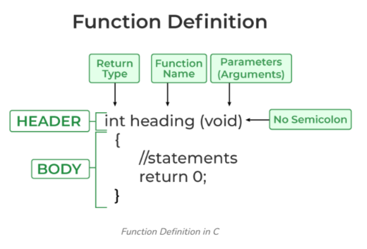
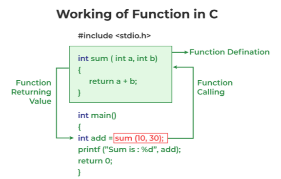

# Function
A function in C is a set of statements that when called perform some specific tasks. every C program consist of at least one function, which is the main( ) function it act as an entry point for program execution.

### Advantages of using function
* Reusability : we can use the same function multiple times from any where we want in the program
* makes code readable by providing modularity
* Reduce size, complexity and repeation of program
* It allows work division in software development
### Disadvantages of Functions in C
* Cannot return multiple values.
* Memory and time overhead due to stack frame allocation and transfer of program control.

## How Does C Function Work?
Working of the C function can be broken into the following steps as mentioned below:

* `Declaring a function`: function Declaration also called as function protyping tells the compiler that there is a function with the given name defined somewhere else in the program. in this step we need to specify the return types and parameters of the function.
* `Defining a function`: This is where the function’s body is provided. Here, we specify what the function does, including the operations to be performed when the function is called.
* `Calling the function`: Calling the function is a step where we call the function by passing the arguments in the function.
* `Executing the function`: Executing the function is a step where we can run all the statements inside the function to get the final result.
* `Returning a value`: Returning a value is the step where the calculated value after the execution of the function is returned. 
* `Exiting the function` is the final step where all the allocated memory to the variables, functions, etc is destroyed before giving full control back to the caller.

## Syntax of Functions in C
The syntax of function can be divided into 3 aspects
- Function Declaration / function prototyping
- Function Definition
- Function Call

### Function Declaration
Function Declaration tells the compiler that the functions exist, its name, return type, and parameters.
```bash
syntax:
    ReturnType functionName (parameter1, parameter2,..);
```
* Return Type − A function generally return a value to its caller.which is using to inform that the task given to that function is completed successfully.
 The returnType is the data type of the value the function returns. It may be int,char etc. Some functions perform the desired operations without returning a value. In this case, the return_type is void.
* Function Name − This is the actual name of the function.this can be anything 
* The function name and the parameter list together constitute the function signature.
* Parameters − Parameters are variables defined in the function declaration or definition to receive values when the function is called.They act as placeholders for the values passed to the function.

```bash
eg:
    int sum(int a, int b);  // Function declaration with parameter names

    # The parameter name is not mandatory while declaring functions
    int sum(int , int);     // Function declaration without parameter names
```
### Function Definition
A function definition consists of a function header and a function body.
function header contain ReturnType, function name and list of parameters (almost same as function declaration) and function Body of contains the instructions need to be executed.
```bash
syntax:
    returnType functionName (para1_type para1_name, para2_type para2_name)
    {
        // body of the function
    }
```


```bash
eg:
    int Sum(int a,int b)
    {
    int sum = a+b;
    return sum;  
    }
```
### Function Call
A function call is a statement that instructs the compiler to execute the function. 
We use the function name and arguments in the function call.
Function call is neccessary to bring the program control to the function definition. If not called, the function statements will not be executed.
```bash
syntax:
    functionName(argument1, argument2, ..., argumentN);
eg:
    sum(10,2);
```


## What is the difference between arguments and parameters?
* `parameters`:
    * Definition: Parameters are variables defined in the function declaration or definition to receive values when the function is called.
    * Location: They are specified in the function's header.
    * Purpose: They act as placeholders for the values passed to the function. 
    * also called as `Formal parameters`.
* `Arguments`: 
    * Definition: Arguments are the actual values or expressions passed to the function when it is called.
    * Location: They are specified in the function call.
    * Purpose: They provide the input data for the function.
    * also called as `actual parameters`.
```console
eg:
    #include <stdio.h>

    // Function definition with parameters
    void greet(char name[], int age) {
        printf("Hello %s, you are %d years old.\n", name, age);
    }

    int main() {
        // Function call with arguments
        greet("Alice", 25);
        return 0;
    }

Parameters: name and age
Arguments: "Alice" and 25
```

## Passing Arguments to a Functions
We can pass arguments to a C function in two ways:
* `Pass by Value` : this method copies values from arguments into parameters. As a result, any processing done to the parameters inside the functions do not reflect in the caller’s arguments.
also called as **call by value**. 

```
eg:
    #include <stdio.h>

    void swap(int var1, int var2)
    {
    int temp = var1;
    var1 = var2;
    var2 = temp;
    }

    int main()
    {
    int var1 = 3, var2 = 2;
    printf("Before swap Value of var1 and var2 is: %d, %d\n",
            var1, var2);
    swap(var1, var2);
    printf("After swap Value of var1 and var2 is: %d, %d",
            var1, var2);
    return 0;
    }
```
* `Pass by Reference`: in this method the address of the variable in which data is stored is passed to the function.
function parameters are pointers in this case. in this method any modification done to parameter inside the function affect arguments. 
```
eg: 
    #include <stdio.h>

    void swap(int *var1, int *var2)
    {
    int temp = *var1;
    *var1 = *var2;
    *var2 = temp;
    }

    // Driver code
    int main()
    {
    int var1 = 3, var2 = 2;
    printf("Before swap Value of var1 and var2 is: %d, %d\n",
            var1, var2);
    swap(&var1, &var2);
    printf("After swap Value of var1 and var2 is: %d, %d",
            var1, var2);
    return 0;
    }
```

## classification of function
Functions are mainly classified into two
1. Library or standard functions
2. User defined functions
###  Library functions
* A library function is also referred to as a `built-in function`. A compiler package already exists that contains these functions, each of which has a specific meaning and is included in the package.
* Built-in functions have the advantage of being directly usable without being defined, whereas user-defined functions must be declared and defined before being used.
* programmer can use this functions anywhere in program by using function call.but programmer must include the corresponding header file in program that contain function need to be used.
Some header files are `Stdio.h , Conio.h, String.h, math.h` etc
* using library functions save development time.
```console
eg: pow(), sqrt(), strcmp(), strcpy() etc.
```
### User defined functions
* Functions that the programmer creates are known as User-Defined functions or “tailor-made functions”.
* User-defined functions can be improved and modified according to the need of the programmer.
* Whenever we write a function that is case-specific and is not defined in any header file, we need to declare and define our own functions according to the syntax.
```
eg: // add is the user defined function here
    #include <stdio.h>

    int add(int a,int b)
    {
    int sum = a+b;
    return sum;  
    }

    int main()
    {
    int sum;
    int var1 = 3, var2 = 2;
    sum = add(var1, var2);
    printf("sum is: %d",sum);
    return 0;
    }
```

|    User defined functions   |    Library functions    |
|-----------------------------|-------------------------|
|Functions created by user|Pre written function present in c library
|User can modify user defined function|User can’t modify library functions
|User defined functions are part of program.|library functions are part of header files like Stdio.h, conio.h etc
|User defined functions Compiled run time(doubt) | library functions Called run time(doubt)

## note:
* function declaration is also called as `function prototyping`
* function parameters are also called as `arguments`
*  based on arguments and return value a function can be classified as
    * Function with no arguments and no return value
    * Function with no arguments and with return value
    * Function with argument and with no return value
    * Function with arguments and with return value
* if a C function dont take any argument is a good practice to use void as argument.
```console
eg:
    int hello(void);
```
* if you leave the argument section blank,that means that the function can take a variable number of arguments of unknown data type
* a C function can be return only one value. To return multiple values, we have to use pointers or structures.

## FAQ 
### Is Function Declaration Necessary?
* A declaration is necessary if the function is called before its definition and if it is used across multiple files.
* in other cases function definition is enough

### is library files are obj,exutable or pure c files
### whar are statis and dynamic library files