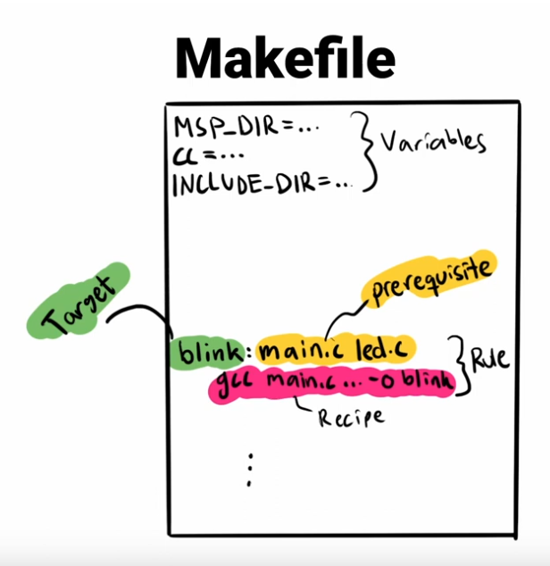

make file came into play when we want to build a big project with multiple source files

you can see that manual building required a big terminal command when we need to pass a lot of flags and options to tool chain.

* one big terminal command make it hard to read and understand
* it is also inefficient, beacause it will build every file in the project eachtime,it is not required when we need to change and build only one file.
* inorder to overcome these problems, we can use makefile.
* make is the program that process the make file
* make file will organize and keep track of our build process
* make file describes how to get a certain output from a set of inputs

